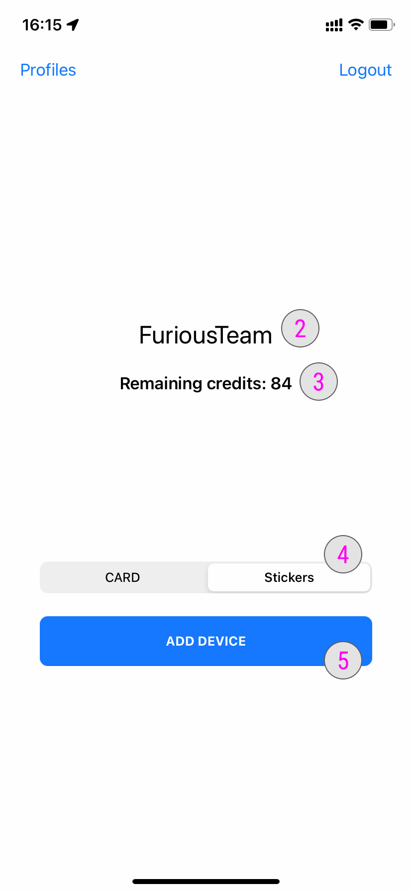

### **Register your own NFC device into our system** 

After you have contacted us and upgraded your WeTaap resseller into a resseller account you will have access to new features on the WeTaap app.

- You need to [Sign into your account](../tutorials/how-to-sign-in.md)

Once you have signed into your account you will see a new menu on the top left of the app called **Admin**

**#1**- Press the **Admin** button to access to your admin account.

### **Presentation of your admin account** 

**#2**- This is your resseller name you provided to us when applying for resseller programm
**#3**- The number of credits available on your resseller account. 1 credit = 1 NFC device activation
**#4**- Select the device type you provided us to us when applying for resseller program. If you want to add more device into your resseller account simply [Contact us](../contact-us.md)
**#5**- Click here to add device into your account so your customers can register it without paying extra fees

- Find the NFC device you want to activate and press the **Add Device** button

- Hold your iPhone near the original NFC tag to read the tag
- The best location to place the NFC is on the back top of your iPhone. On the left side of the camera sensor.

You should see the following message to confirm the NFC Tag has been successfully activated and registed to our system. It is now ready for sale and ready to be use for your customers.

