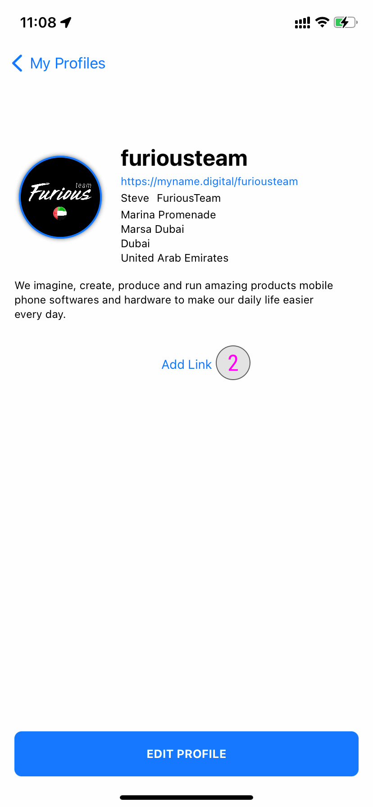
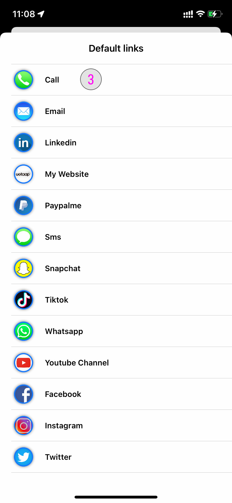
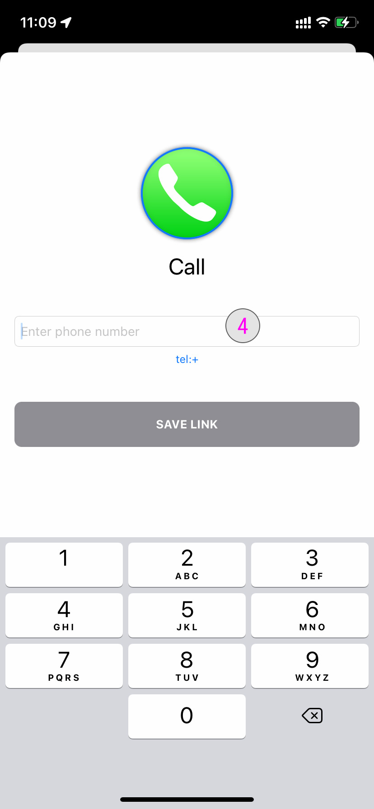
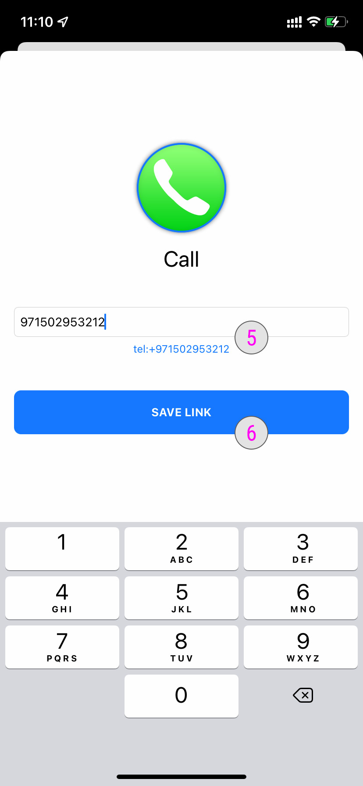
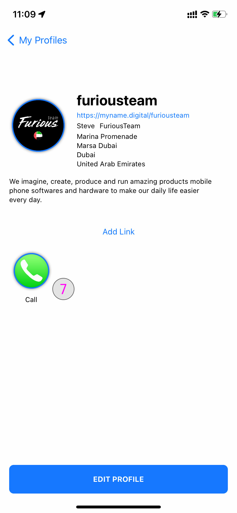

### **Add link(s) to a profile** 

Once you have signed into your account and you already have created at least one profile. You will see the list of profiles here.

### **Select a profile to add links** 

**#1**- Tap on it to see the profile details to select your profile. You will now be redirected to the profile details.

### **Select a profile to edit** 

**#2**- Once you are on the profile, tap the **Add Link** button.

### **Select Link** 

**#3**- The list of default links will now open. Tap the link you want to add. In this exemple we are going to use **Call**.

### **Enter Link** 

**#4**- You can now add the details for your link. In this exemple we are going to add the phone number with international format. Only add the numbers with your country code.

### **Preview Link** 

**#5**- When entering the link you can see the preview of it. Make sure it is correct.
**#6**- Once you are done. Tap the **Save Link** button

### **Save Link** 

**#7**- The link has now be added to your profile. If you Tap the icon you can test the action.

