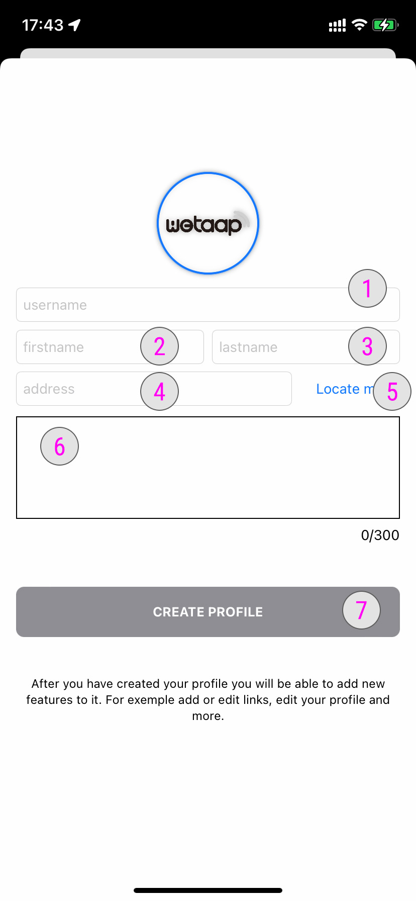

### **Create a profile** 

Once you have signed into your account you will see the main screen of the WeTaap app with a single button **Add a profile**

### **Create a profile details** 

1. Enter the username of your profile. This username will be used to create your public profile URL. (for ex: [myname.digital/username](https://myname.digital/username))
2. Enter your first name as it will appears on your profile
3. Enter your last name as it will appears on your profile
4. Enter your phisical address
5. Tap the **Locate Me** button to use your current address. (You will need to authorize location service on your device)
6. Enter a short description of yourself to be used on your profile. Maximum 300 characters
7. Tap the **Create Profile** button to create your profile