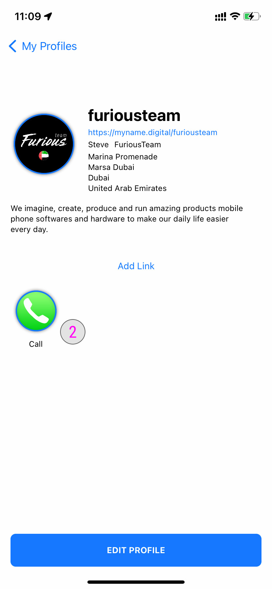
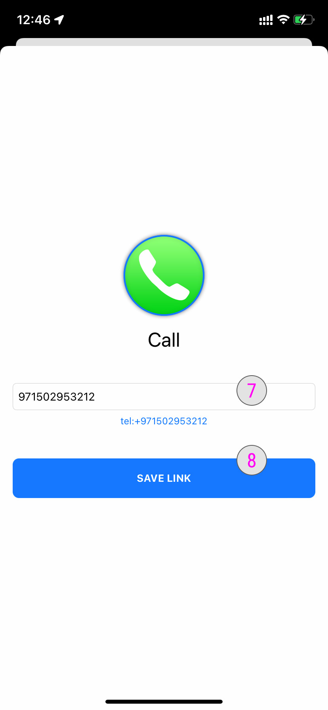

### **How to edit an existing link** 

Once you have created a link you can edit the content or delete it.

### **Select a profile to edit link** 

**#1**- Tap on it to see the profile details to select your profile. You will now be redirected to the profile details.

### **Select a link to edit** 

**#2**- Select the link you want to edit and keep pressing (2 seconds) on the icon to load the options available.

### **Link Options** 

There is different options for each link as follow:

**#3**- To find out more details about **Direct Link** please click here. **(NEED TO ADD LINK)**

**#4**- Tap the **Edit** button to edit the content of a link. You will be redirected to the [Edit Link Details](../tutorials/how-to-edit-a-link.md#edit-link-content)

**#5**- Tap the **Delete** button to delete this link from your profile

**#6**- Tap the **Cancel** button to return to your profile details

### **Edit Link Content** 

**#7**- Enter the modifications you would like to do. For exemple a new phone number.

**#8**- Tap the **Save Link** button

Your link content has now been successfully modified.