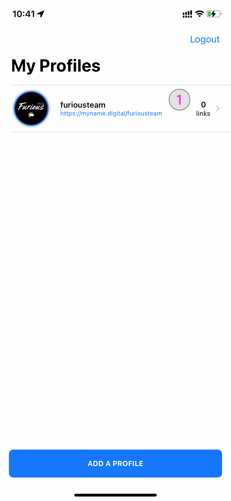
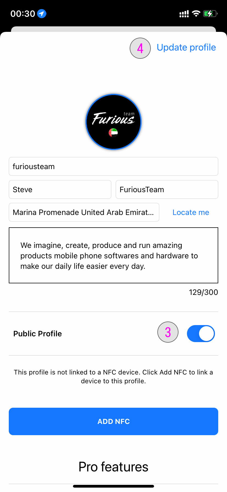

### **Edit a profile** 

Once you have signed into your account and you already have created at least one profile. You will see the list of profiles here.

### **Select a profile to edit** 

**#1**- Tap on it to see the profile details. You will now be redirected to the profile details.

### **Profile details** 

**#2**- To edit your profile tap on the **Edit Profile** button.

### **Edit your profile details** 

Here you can edit your profile details such as :

- Username (if you change your username, your public URL will also be changed)
- First Name and Last Name
- Edit your address manually or Tap the **Locate Me** button to use your current address. (You will need to authorize location service on your device)
- Edit the short description of your profile. Maximum 300 characters

**#3**- Your profile is by default set to private. If you want to make your profile public please select **Public Profile**
**#4**- Once your are done editing your profile details, tap the **Update profile** button

