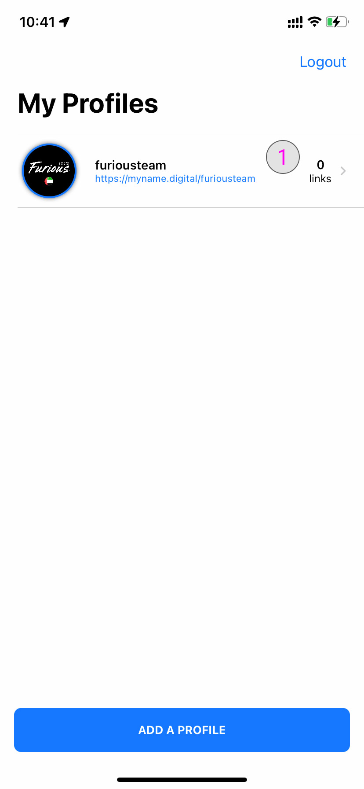

### **How to link a NFC device to my profile** 

Once you have created a profile you will be able to link a NFC device to it.

### **Select a profile to add NFC device** 

**#1**- Tap on it to see the profile details to select your profile. You will now be redirected to the profile details.

### **Profile details** 

**#2**- To add a NFC to profile tap on the **Edit Profile** button.

### **Add NFC to a profile** 

**#3**- Scroll down and tap on the **Add NFC** button.

### **Link NFC to your account** 

2 cases apply to this features :

1. If you bought an original NFC device from [WeTaap or one of our reseller](https://myname.digital/#buy-nfc-devices) the activation is FREE.
2. If you bought a compatible NFC device not from WeTaap or not from one of our reseller the activation cost 1.29$ per device. One time only.

### **Link an original WeTaap NFC device** 

- Find the original NFC device and press the **Add NFC** button
- Hold your iPhone near the original NFC tag to read the tag
- The best location to place the NFC is on the back top of your iPhone. On the left side of the camera sensor.

Once the NFC tag data has been readed you will see the following message:

1. The type of your NFC Tag
2. The resseller name of your NFC Tag
3. The serial number of your NFC Tag
4. Press **Link to my account** button to connect this NFC tag with your profile

You should see the following message to confirm the NFC Tag has been successfully written.

Then you will be redirected to your profile and it will now display the NFC Tag you just connected to it with the folliwng details :

- The type of your NFC Tag
- The resseller name of your NFC Tag
- The serial number of your NFC Tag
- The activation date

### **UnLink a NFC device from your profile** 

If you want to unlink this NFC Tag from your profile press the **Unlink from my account** button. You will be able to link this NFC tag again when you want it.

### **Link an non original WeTaap NFC device** 

If you bought a compatible NFC device not from WeTaap or not from one of our reseller the activation cost 1.29$ per device. One time only.

- Find the NFC device and press the **Add NFC** button
- Hold your iPhone near the original NFC tag to read the tag
- The best location to place the NFC is on the back top of your iPhone. On the left side of the camera sensor.

