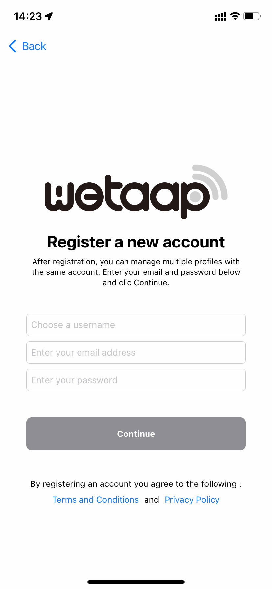
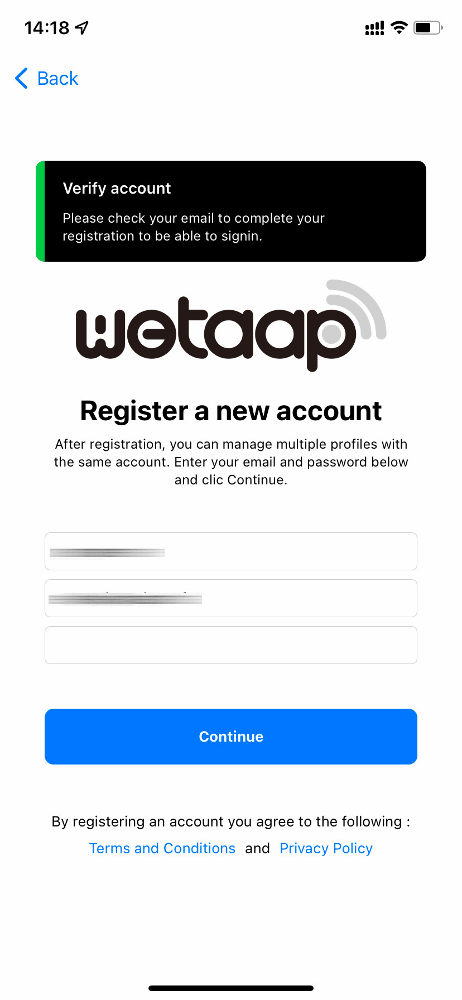
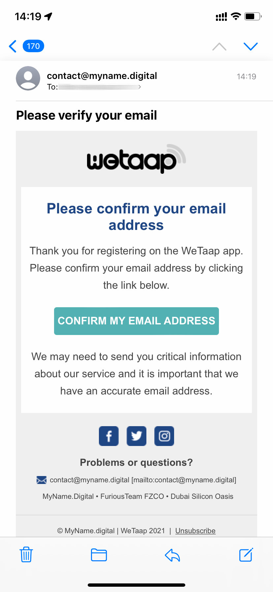
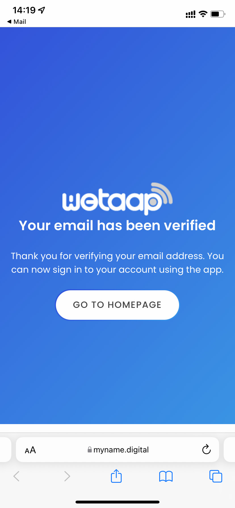

### **Register on WeTaap** 

There is currently two ways to register on the WeTaap app:

- [Register with your email address and create your password](../tutorials/how-to-register.md#register-with-email)
- [Register using your Apple ID](../tutorials/how-to-register.md#register-with-apple-id). (No need to create a password)

### **Screenshot** 

### **1 - Register with your Email address** 
Using this option you will have to enter your email address and create your own password to use with the WeTaap app.

- Tap **Register a new account**
- On the next screen :

- Choose your username. This username is only for your account and has nothing to do with futures profiles you might create.
- Enter your email address
- Enter your password
- Tap the **Continue** button. You should see the following message:

- Now go to your mail box and click the **Confirm my email address** button. If you do not see the email make sure to check in the SPAM folder and allow myname.digital has trusted sender so you can be sure to receive our emails next time.

- You will be redirected to the myname.digital website and you should see a message that says your email has been verified.

You can now login with your email address and password using the **Sign into an existing account** button

### **2 - Register with your Apple ID** 
Using this method you won't need to enter your email address and password. It will use your Apple ID.
You can choose to share your real email address or the one generated by Apple.

- Tap **Sign in with Apple**
- Choose your real email adress or the one generated by Apple
- Confirm by entering your passcode or using FaceID
- You will be redirected to the main section of the WeTaap app and automatically logged in using your Apple ID.

