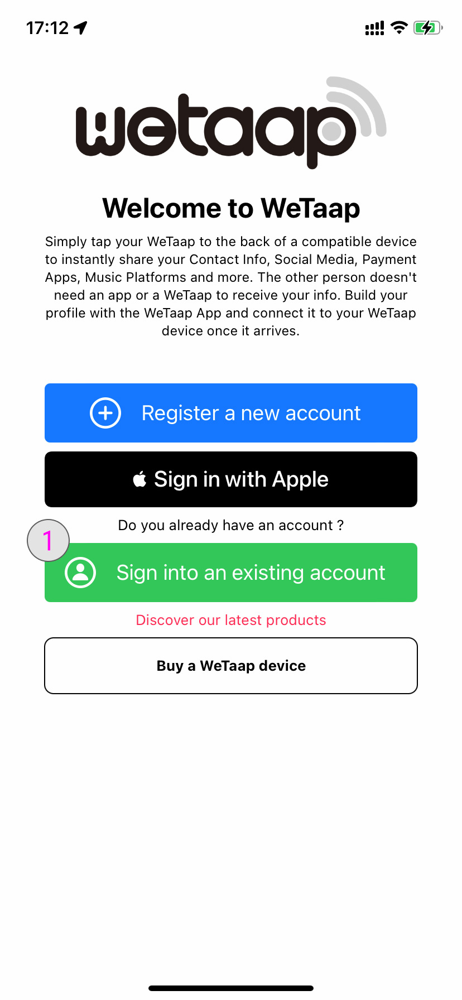
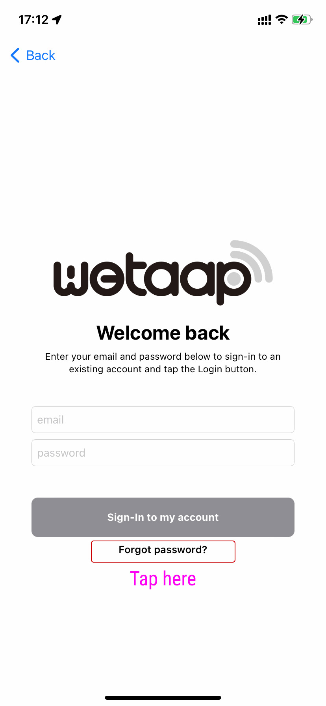
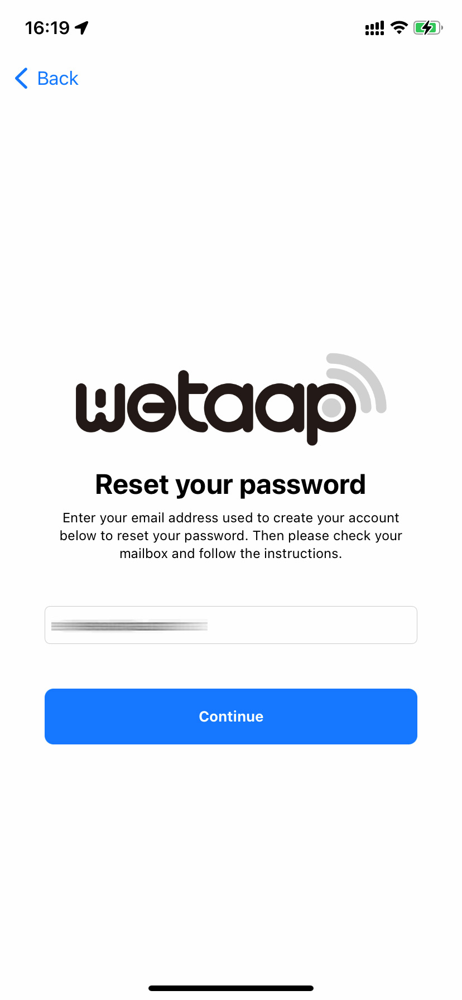

### **Reset your WeTaap password** 

If you created an account using your email address and own password and you forgot your password for the WeTaap you can reset it at anytime.

If you used the Sign-Up / Sign-In with Apple you won't need to remember your password or reset it.

### **How to reset your WeTaap password** 

- Launch the WeTaap app and select **Sign into an existing account**

- Then tap the **Forgot Password?** button

- Enter the email address you used to register your account

