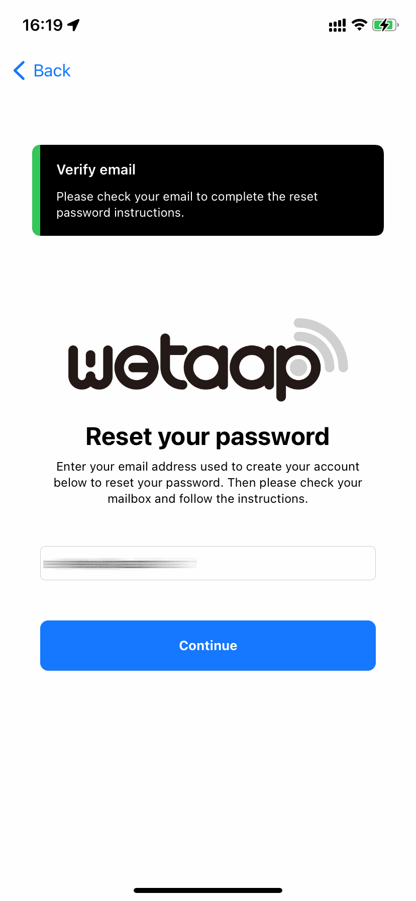
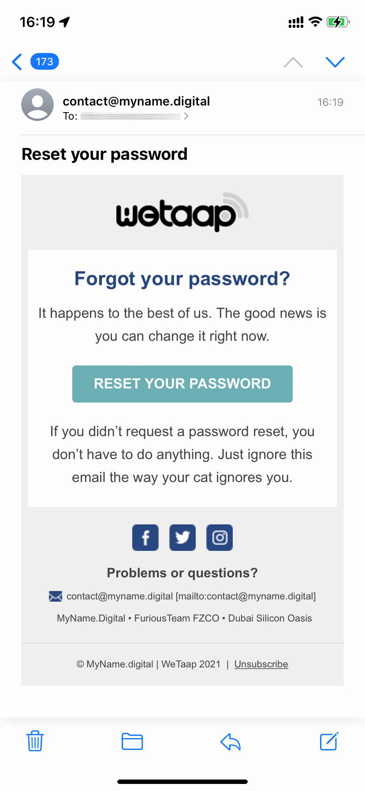
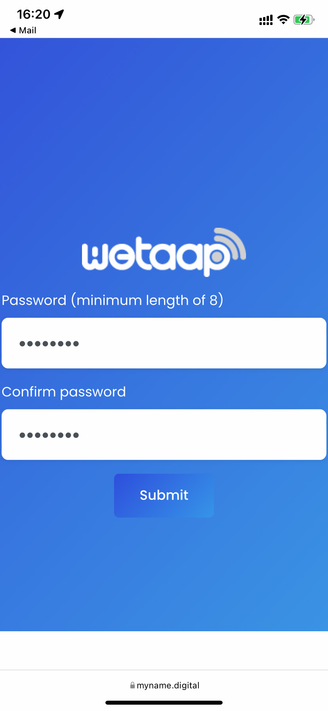

### **Reset your WeTaap password** 

If you created an account using your email address and own password and you forgot your password for the WeTaap you can reset it at anytime.

If you used the Sign-Up / Sign-In with Apple you won't need to remember your password or reset it.

### **How to reset your WeTaap password** 

- Launch the WeTaap app and select **Sign into an existing account**

- Then tap the **Forgot Password?** button

- Enter the email address you used to register your account and tap the **Continue** button

- If your email is present in our database you will get a message that tells you to check your mail box to complete the reset password instructions. If you do not see the email make sure to check in the SPAM folder and allow myname.digital has trusted sender so you can be sure to receive our emails next time.

- Go to your mailbox and click the **Reset your password** button.

- You will be redirected to the official website and asking you to enter your new password. It must have a lenght of 8 characters minimum. Then click the **submit** button.

- Once complete you should get the following message tells you that your password has been successfully changed. You can not sign into your account.

