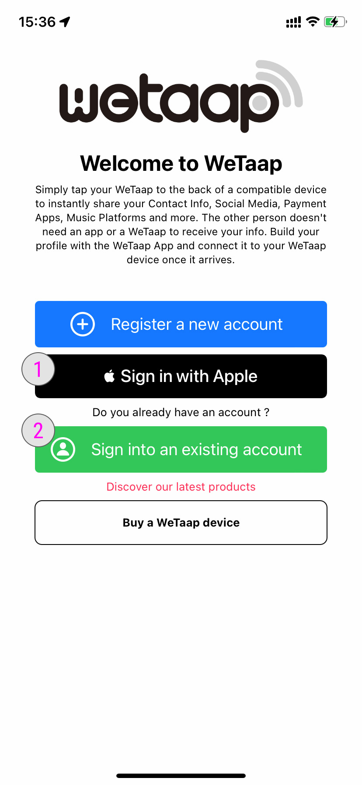
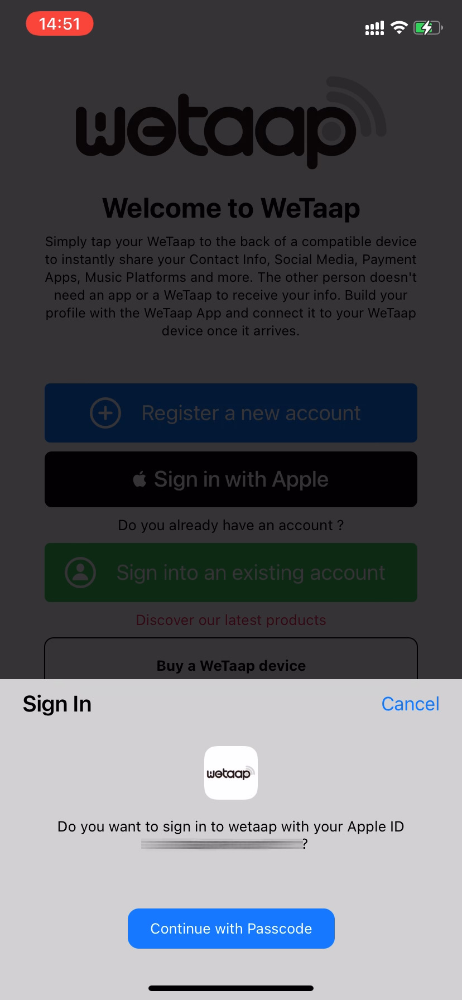
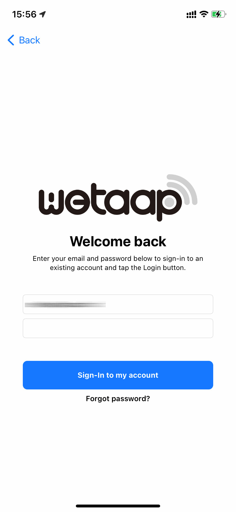

### **Sign into your account on WeTaap** 

There is currently two ways to sign into your account on the WeTaap app:

- [Sign into your account with Apple ID](../tutorials/how-to-sign-in.md#signin-with-apple-id)
- [Sign into your account with your email address and password](../tutorials/how-to-sign-in.md#signin-with-email)

### **Screenshot** 

### **1 - Sign into your account with your Apple ID** 
Using this method you won't need to enter your email address and password. It will use your Apple ID.
You can choose to share your real email address or the one generated by Apple.

- Tap **Sign in with Apple**
- Choose your real email adress or the one generated by Apple
- Confirm by entering your passcode or using FaceID
- You will be redirected to the main section of the WeTaap app and automatically logged in using your Apple ID.

### **2 - Sign into your account with email and password** 

- Tap **Sign into an existing account**
- Enter your email address and password that you used at the [registration process](../tutorials/how-to-register.md#register-with-email)

- You will be redirected to the main section of the WeTaap app and automatically logged in using your Apple ID.

